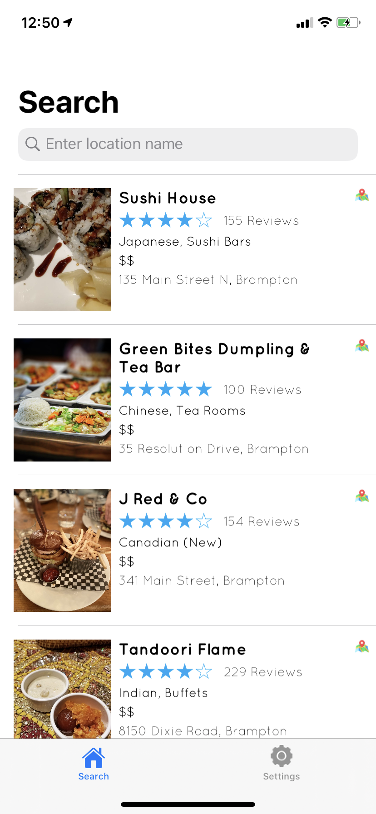
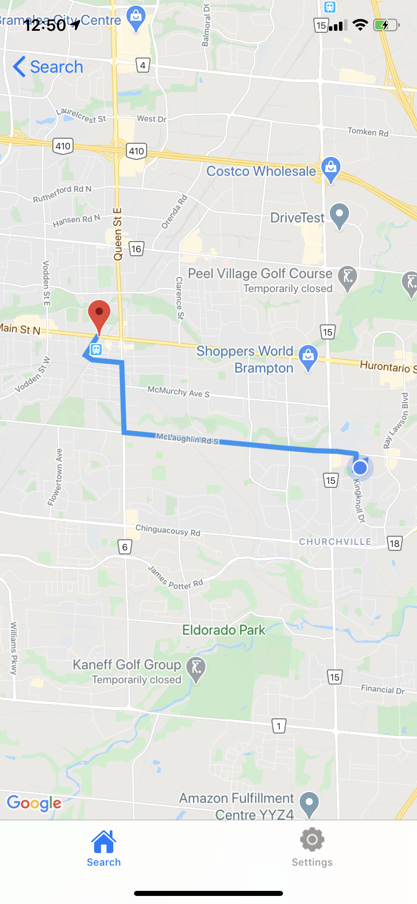
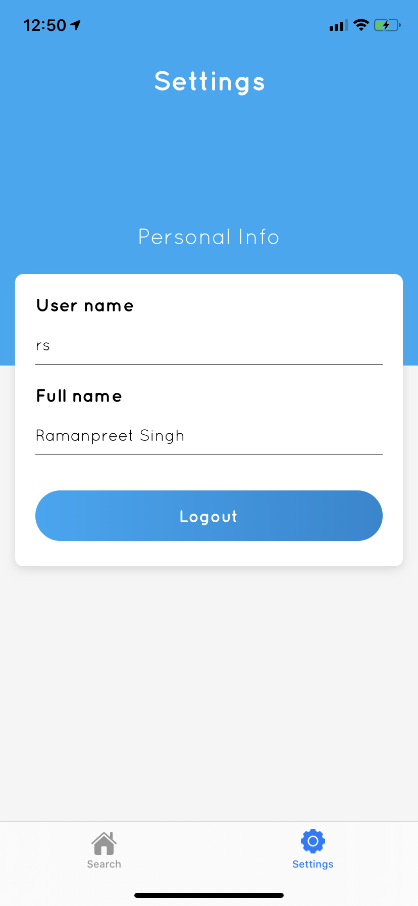
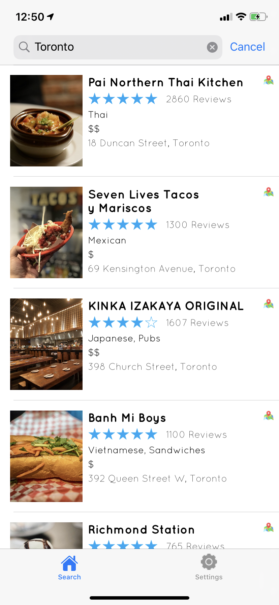

# EasyFind

Find local restaurants, read expert customer reviews, and start searching for restaurants near you with Yelp.
  - **Swift 5**
  - **Mapkit**
  
# App Screens

             
 

             
 

 
 # App Flow
 
| Video link | [App flow] |
| ------ | ------ |

  #  Features!

  - Find the newest and hottest restaurants in your area
  - Search restaurant results by location
  - Get Route between your location & Restaurants
  
### Installation

 - Open  [public repository][git]
 - Here you can clone or download project
 - You can also open in Xocde directly

  ### Tech

EasyFind uses a number of open source projects to work properly:

* [Swift] - Language used to build this app. 
* [Yelp API] - The Yelp Fusion API allows you to get the best local content and user reviews from millions of businesses across 32 countries. This tutorial provides an overview of the capabilities our suite of APIs offer, provides instructions for how to authenticate API calls, and walks through a simple scenario using the API.

And of course EasyFind itself is open source with a [public repository][git]
 on GitHub.

### Libraries

EasyFind is currently extended with the following libraries. Instructions on how to use them in your own application are linked below.

| Pods | Repository |
| ------ | ------ |
| Alamofire | [Alamofire] |
| Cosmos | [Cosmos] |
| IQKeyboardManagerSwift | [IQKeyBoard] |
| SDWebImage | [SDWebImage] |

[//]: # (These are reference links used in the body of this note and get stripped out when the markdown processor does its job. There is no need to format nicely because it shouldn't be seen. Thanks SO - http://stackoverflow.com/questions/4823468/store-comments-in-markdown-syntax)

    
   [git]: <https://github.com/RamaniOS/EasyFind.git>
   [swift]: <https://developer.apple.com/documentation/swift>
   [yelp API]: <https://www.yelp.com/developers/v3/manage_app>
   [alamofire]: <https://github.com/Alamofire/Alamofire>
   [cosmos]: <https://github.com/evgenyneu/Cosmos>
   [SDWebImage]: <https://github.com/SDWebImage/SDWebImage>
   [IQKeyboard]: <https://github.com/hackiftekhar/IQKeyboardManager/tree/master/IQKeyboardManagerSwift>
   [App Flow]: <https://youtu.be/PoUv_gJhoJU>

   
   